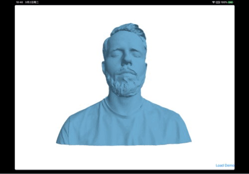

#  An example for camera manipulation in Metal

This is a demo showing how to implement basic camera manipulation using Metal. The camera manipulation includes:

- One finger pan to rotate the scene, i.e. the trackball;
- Two finger pinch to zoom in/out the scene;
- Two finger pan to translate the scene along the current camera view plane.

To show the manipulation, this demo also includes a very simple PLY binary format reader.

Here is the screen shot running on my iPad Pro:

